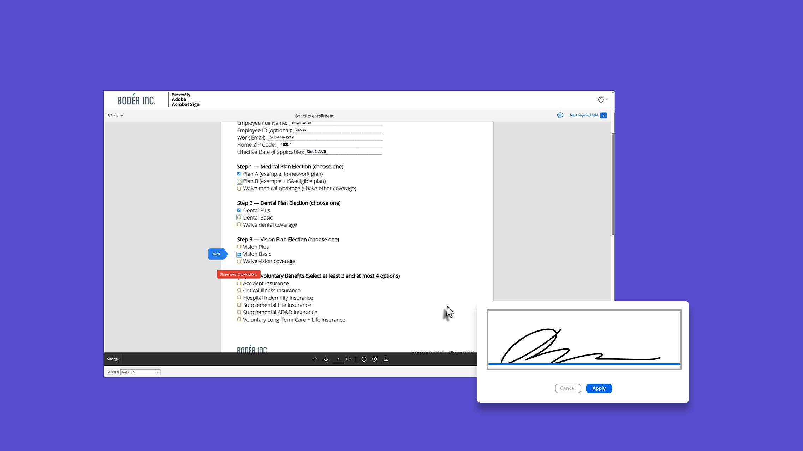

# Panoramica della Guida introduttiva

Scopri come inviare, firmare e monitorare i documenti con queste brevi esercitazioni guidate. Avvia un rapido tour di Acrobat Sign e invia un documento a una o più persone. Questo contenuto è progettato per semplificare i flussi di lavoro di firma elettronica.

## Novità

>[!BEGINTABS]

>[!TAB Quando utilizzare Crea una copia]

Scopri come utilizzare [Creare una copia](../sign-beginner-tutorials/create-a-copy.md) per duplicare un accordo esistente. Puoi regolare ciò che deve essere modificato e inviarlo di nuovo in pochi secondi. Nessuna ricostruzione da zero.

>[!TAB Modifica di un documento dopo l&#39;invio]

Scopri come [modificare un documento](../sign-beginner-tutorials/manage-and-track.md) già inviato per la firma.

>[!TAB Gestire e tenere traccia degli accordi]

Scopri come [gestire e tenere traccia degli accordi](../sign-beginner-tutorials/manage-and-track.md) inviati per la firma.

>[!TAB Firmare elettronicamente un documento]

Scopri quanto è facile [firmare](../sign-beginner-tutorials/electronically-sign-a-document.md) un documento che ti viene inviato con Acrobat Sign.

>[!ENDTABS]

## Invia

<table style="table-layout:fixed">
<tr>
  <td>
    
    

    <a href="new-sender.md"><strong>Introduzione ad Acrobat Sign</strong></a>
    

    Questo tutorial è un ottimo punto di partenza per i nuovi utenti di Acrobat Sign
     
  </td>
 <td>
    
    

    <a href="quick-tour.md"><strong>Nozioni di base sull'area di lavoro</strong></a>
    

    Fai un rapido tour dell’area di lavoro di Acrobat Sign per iniziare a utilizzarla
     
  </td>
  <td>
    
    

    <a href="send-to-single-recipient.md"><strong>Invia un documento a un singolo firmatario</strong></a>
    

    Scopri quanto è facile inviare un documento da firmare
     
  </td>
  <td>
    
    

    <a href="send-to-multiple-recipients.md"><strong>Invia a più firmatari</strong></a>
    

    Invia un documento da firmare con firma elettronica a più persone nell’ordine giusto
     
  </td>
</tr>
<tr>
  <td>
    
    

    <a href="sending-options.md"><strong>Configurare le opzioni di invio</strong></a>
    

    Scopri come configurare varie opzioni per inviare un documento da firmare
     
  </td>
  <td>
    
    

    <a href="adding-fields.md"><strong>Aggiunta di campi ai documenti</strong></a>
    

    Scopri come aggiungere diversi tipi di campi ai documenti
     
  </td>
  <td>
    
    

    <a href="modify-in-flight.md"><strong>Modifica di un documento dopo l'invio</strong></a>
    

    Scopri come modificare un documento già in corso
     
  </td>
  <td>
    
    

    <a href="replace-signer.md"><strong>Sostituzione di un firmatario</strong></a>
    

    Scopri come cambiare il firmatario di un documento già in corso
      
  </td>
</tr>
<tr>
  <td>
      
      

      <a href="set-deadlines-reminders.md"><strong>Impostare scadenze e promemoria</strong></a>
      

      Scopri come inviare promemoria e scadenze regolari tramite e-mail per far firmare rapidamente i tuoi documenti
       
    </td> 
  <td>
    
    

    <a href="../sign-advanced-users/create-a-template.md"><strong>Creare un modello riutilizzabile</strong></a>
    

    Crea un modello di documenti da riutilizzare per velocizzare il lavoro e migliorare la coerenza per la tua organizzazione
     
  </td>
  <td>
     
    

    <a href="checkbox-groups.md"><strong>Guida alle selezioni necessarie con gruppi di caselle di controllo</strong></a>
    

    Scopri come utilizzare i gruppi di caselle di controllo per controllare quante opzioni un firmatario può selezionare in un modulo
     
    </td>
  <td>
     
    

    <a href="create-a-copy.md"><strong>Quando utilizzare Crea una copia</strong></a>
    

    Scopri come utilizzare Crea una copia per duplicare un accordo esistente
     
    </td>
</tr>
</table>

## Firmare

<table style="table-layout:fixed">
<tr>
  <td>
    
    

    <a href="electronically-sign-a-document.md"><strong>Firmare elettronicamente un documento</strong></a>
    

    Scopri quanto è facile firmare un documento che ti è stato inviato con Acrobat Sign
     
  </td>
  <td>
    
    

    <a href="fill-and-sign.md"><strong>Compilazione e firma di un documento</strong></a>
    

    Compila i moduli e aggiungi la tua firma elettronica ai documenti
     
  </td>
  <td>
    
    

    <a href="sign-in-person.md"><strong>Ottenere una firma di persona</strong></a>
    

    Ottenere la firma di qualcun altro di persona utilizzando l’app Acrobat Sign per dispositivi mobili
     
  </td>
  <td>
    
    

    <a href="delegate-signing.md"><strong>Delega la firma a un altro utente</strong></a>
    

    Scopri come delegare la firma di un documento a un altro utente
     
  </td>
</tr>
<tr>
  <td>
    
    

    <a href="sign-with-a-digital-signature.md"><strong>Che cos'è una firma digitale</strong></a>
    

    Informazioni sulle firme digitali basate su certificati
     
  </td>
  <td>
    
    

    <a href="sign-with-a-stamp.md"><strong>Firma con timbro</strong></a>
    

    Usa i timbri per contrassegnare un documento approvato o completato
      
  </td> 
 <td>
    
    

     
  </td>
  <td>
    
    

     
  </td>
</tr>  
</table>

## Gestisci

<table style="table-layout:fixed">
<tr>
  <td>
    
    

    <a href="manage-and-track.md"><strong>Gestisci e tieni traccia degli accordi</strong></a>
    

    Scopri come gestire e tenere traccia degli accordi inviati da firmare
     
  </td>
  <td>
    
    

     
  </td>
  <td>
    
    

     
  </td>
  <td>
    
    

     
  </td>
</tr>
</table>
