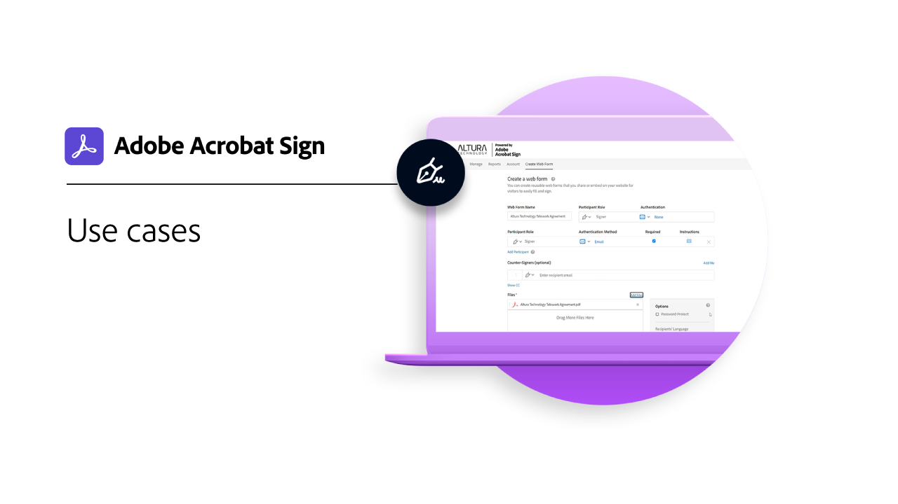

# Panoramica su settori e reparti

Scopri come Trasforma le esperienze di firma elettronica della tua organizzazione esplorando questi casi d&#39;uso, ricette e webinar reali del settore e dei dipartimenti.

<table style="table-layout:fixed">
<tr>
  <td>
    
    

    <a href="innovation-series.md"><strong>Generatore di abilità</strong></a>
    

    <em>Partecipate con noi per un corso di formazione di 30 minuti su come utilizzare le vostre firme elettroniche, senza aggiungere altro lavoro</em>
     
  </td>
  <td>
    
    

    <a href="recipes.md"><strong>Casi di utilizzo</strong></a>
    

    <em>Esplora il modo in cui le varie organizzazioni utilizzano Acrobat Sign con questi casi d'uso reali</em>
     
  </td>
 </td>
  <td>
    
    

     
  </td>
  <td>
    
    

     
  </td>
</tr>
</table>
