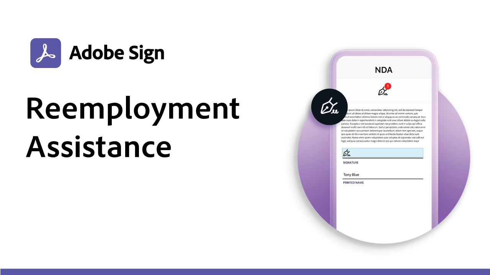

# Esempi di utilizzo

Accelera i flussi di lavoro digitali della tua organizzazione con questi esempi di firma elettronica per enti pubblici e aziende. Fai clic per visualizzare un PDF con le risorse e i dettagli su come configurare questi casi d’uso specifici della firma elettronica.

## Esempi d&#39;uso governativi

<table style="table-layout:fixed">
<tr>
  <td>
    
    

    <a href="usecasegovgrants.md"><strong>Sovvenzioni e prestiti alle imprese</strong></a>
    

    <em>Fornire assistenza rapida alle aziende fornendo accesso self-service ai moduli di richiesta di sovvenzioni, prestiti e differimento fiscale</em>
     
  </td> 
  <td>
    
    

    <a href="usecasegovtelework.md"><strong>Accordo sul telelavoro</strong></a>
    

    <em>Raccogli in modo efficiente le firme di tutti i tuoi dipendenti su accordi di telelavoro, aggiornamenti delle policy e altro ancora</em>
     
  </td>
  <td>
    
    

    <a href="usecasegovcontracts.md"><strong>Moduli di richiesta e contratti</strong></a>
    

    <em>Sostituisci rapidamente l'elaborazione cartacea con flussi di lavoro digitali conformi, completi di report di audit</em>
     
  </td>
</tr>
<tr>
  <td>
    
    

    <a href="usecasegovreemployment.md"><strong>Assistenza Alla Rioccupazione</strong></a>
    

    <em>Aiuta i cittadini a ricevere l'aiuto di cui hanno bisogno senza essere in linea con i moduli di richiesta interamente digitali che possono essere utilizzati in tempo reale</em>
     
  </td>
  <td>
    
    

    <a href="usecasegovpaycheck.md"><strong>Protezione della busta paga</strong></a>
    

    <em>Scopri come utilizzare Acrobat Sign per convertire il modulo del programma Protezione pagamenti in un modulo interattivo online</em>
     
  </td>
  <td>
    
    

    <a href="usecasegovremote.md"><strong>Richiesta di autorizzazione remota</strong></a>
    

    <em>Usa le firme elettroniche e le conferenze via web insieme per ridurre il tempo necessario per richiedere e garantire i mandati dei giudici</em>
     
  </td>
</tr>
</table>

## Casi d&#39;uso commerciali

<table style="table-layout:fixed">
<tr>
  <td>
    
    

    <a href="usecasecomcontracts.md"><strong>Moduli di richiesta e contratti</strong></a>
    

    <em>Sostituisci rapidamente l'elaborazione cartacea con flussi di lavoro digitali conformi, completi di report di audit</em>
     
  </td> 
  <td>
    
    

    <a href="usecasecompolicy.md"><strong>Accordi politici</strong></a>
    

    <em>Raccogli in modo efficiente le firme di tutti i tuoi dipendenti su accordi e aggiornamenti relativi alle policy</em>
     
  </td>
  <td>
    
    

    <a href="usecasecomtelework.md"><strong>Accordo sul telelavoro</strong></a>
    

    <em>Raccogli in modo efficiente le firme di tutti i tuoi dipendenti sugli accordi di telelavoro</em>
     
  </td>
</tr>
</table>
