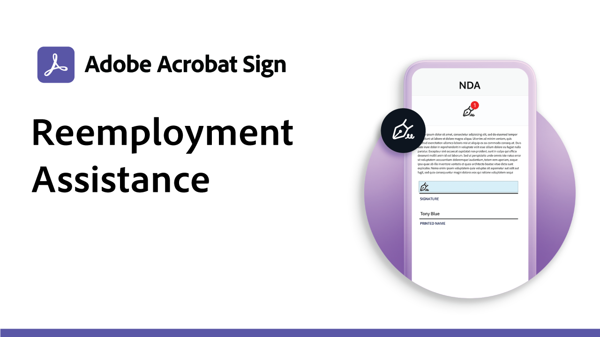

# Usa ricette case

Accelerare i flussi di lavoro digitali dell&#39;organizzazione con questi esempi governativi e commerciali di firma elettronica. Fare clic per visualizzare un PDF con risorse e dettagli su come impostare questi casi specifici di utilizzo della firma elettronica.

## Casi di utilizzo pubblico

<table style="table-layout:fixed">
<tr>
  <td>
    
    

    <a href="usecasegovgrants.md"><strong>Sovvenzioni e prestiti alle imprese</strong></a>
    

    <em>Fornire assistenza rapida alle imprese fornendo l'accesso self-service ai moduli di richiesta di concessione, prestito e differimento delle imposte</em>
     
  </td> 
  <td>
    
    

    <a href="usecasegovtelework.md"><strong>Contratto di Telefonia</strong></a>
    

    <em>Raccolta efficiente delle firme di tutti i dipendenti su contratti di lavoro, aggiornamenti dei criteri e altro ancora</em>
     
  </td>
  <td>
    
    

    <a href="usecasegovcontracts.md"><strong>Contratti e moduli richiesta</strong></a>
    

    <em>Sostituisce rapidamente l'elaborazione della carta con flussi di lavoro digitali conformi, completi di report di controllo</em>
     
  </td>
</tr>
<tr>
  <td>
    
    

    <a href="usecasegovreemployment.md"><strong>Assistenza alla rioccupazione</strong></a>
    

    <em>Aiuta i cittadini ad ottenere l'aiuto di cui hanno bisogno senza essere in linea con i moduli applicativi digitali che possono essere trasmessi in tempo reale</em>
     
  </td>
  <td>
    
    

    <a href="usecasegovpaycheck.md"><strong>Protezione pagamento</strong></a>
    

    <em>Scopri come utilizzare Adobe Sign per convertire il modulo del programma di protezione pagamento in un modulo interattivo online</em>
     
  </td>
  <td>
    
    

    <a href="usecasegovremote.md"><strong>Richiesta di mandato remoto</strong></a>
    

    <em>Utilizzare le firme elettroniche e le conferenze web insieme per ridurre il tempo necessario per richiedere e ottenere i mandati dai giudici</em>
     
  </td>
</tr>
</table>

## Casi di uso commerciale

<table style="table-layout:fixed">
<tr>
  <td>
    
    

    <a href="usecasecomcontracts.md"><strong>Contratti e moduli richiesta</strong></a>
    

    <em>Sostituisce rapidamente l'elaborazione della carta con flussi di lavoro digitali conformi, completi di report di controllo</em>
     
  </td> 
  <td>
    
    

    <a href="usecasecompolicy.md"><strong>Accordi sui criteri</strong></a>
    

    <em>Raccolta efficiente delle firme di tutti i dipendenti su contratti di lavoro, aggiornamenti dei criteri e altro ancora</em>
     
  </td>
  <td>
    
    

     
  </td>
</tr>
</table>
