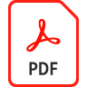

# Richiesta di garanzia remota

Utilizza le firme elettroniche e le conferenze Web insieme per ridurre il tempo necessario per richiedere e proteggere i mandati dei giudici.

>[!VIDEO](https://video.tv.adobe.com/v/33813?quality=12&learn=on&hidetitle=true)

Selezionare questa opzione per scaricare o aprire una ricetta PDF dettagliata per la richiesta di garanzia remota.

